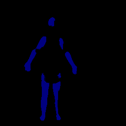

# U-Net 图像边缘分割

基于 PyTorch 实现的 U-Net 语义分割网络，用于图像边缘检测与分割任务。在 [Pytorch-UNet](https://github.com/milesial/Pytorch-UNet) 基础上进行修改，适配自定义数据集进行边缘分割训练与推理。

## 项目目的

利用 U-Net 编码器-解码器架构实现像素级图像分割，从输入图像中精确提取边缘信息，适用于工业检测、医学影像分析、遥感影像处理等需要精确边缘定位的场景。

## 核心功能

- **U-Net 语义分割**：经典编码器-解码器结构，含跳跃连接（Skip Connection），保留细粒度空间信息
- **自定义数据集训练**：支持 JPEG 图像 + 分割掩码（SegmentationClass）格式的数据集
- **模型训练**：支持 Dice Loss + 交叉熵混合损失、动态学习率调度、梯度裁剪、混合精度训练
- **单图推理**：加载训练好的权重对单张图像进行边缘分割预测并可视化
- **模型评估**：在验证集上计算 Dice 系数评估分割精度
- **WandB 实验追踪**：集成 Weights & Biases 进行训练过程可视化

## 技术架构

```
输入图像 (JPEG)
    ↓
U-Net 编码器（双卷积 + 最大池化 × 4）
    ↓
U-Net 瓶颈层（双卷积）
    ↓
U-Net 解码器（上采样 + 跳跃连接拼接 + 双卷积 × 4）
    ↓
1×1 卷积输出层
    ↓
分割掩码（边缘/非边缘）
```

## 使用说明

### 环境安装

```bash
pip install -r requirements.txt
```

### 准备数据集

将图像和分割标注放置在以下目录：

```
JPEGImages/          # 原始图像
SegmentationClass/   # 对应的分割掩码
```

### 训练模型

```bash
python train.py --epochs 50 --batch-size 4 --learning-rate 0.0001 --scale 0.5
```

### 预测推理

```bash
python predict.py -i input.jpg -o output.png --model checkpoints/checkpoint.pth
```

### 单图快速推理

```bash
python 1.py
```

## 项目结构

```
.
├── train.py              # 模型训练脚本
├── predict.py            # 批量预测脚本
├── evaluate.py           # 模型评估脚本
├── 1.py                  # 单图快速推理脚本
├── hubconf.py            # PyTorch Hub 配置
├── unet/                 # U-Net 模型定义
│   ├── unet_model.py     # 完整 U-Net 网络
│   └── unet_parts.py     # 网络组件（双卷积、下采样、上采样等）
├── utils/                # 工具模块
│   ├── data_loading.py   # 数据集加载
│   ├── dice_score.py     # Dice 系数计算
│   └── utils.py          # 辅助函数
├── JPEGImages/           # 训练图像（需自行准备）
├── SegmentationClass/    # 分割掩码（需自行准备）
├── checkpoints/          # 模型检查点
├── requirements.txt      # 项目依赖
├── Dockerfile            # Docker 部署文件
└── LICENSE               # GPL-3.0 开源协议
```

## 分割效果展示



## 适用场景

- 图像边缘检测与提取
- 工业零件轮廓分割
- 医学影像区域分割
- 遥感影像地物边界提取
- 语义分割方法学习与实践

## 技术栈

| 组件 | 技术 |
|------|------|
| 深度学习框架 | PyTorch |
| 网络架构 | U-Net |
| 图像处理 | Pillow, OpenCV, NumPy |
| 实验追踪 | Weights & Biases |
| 可视化 | Matplotlib |

## 致谢

本项目基于 [milesial/Pytorch-UNet](https://github.com/milesial/Pytorch-UNet) 修改开发。

## License

GPL-3.0 License
